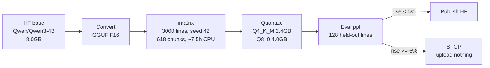
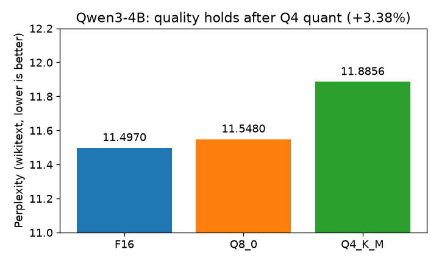
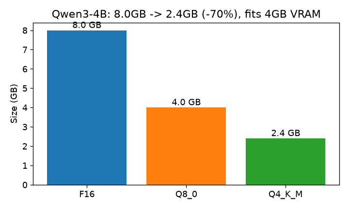

# Qwen3-4B GGUF — verified 4GB edge build

[](https://huggingface.co/ShayonSarker/Qwen3-4B-Q4_K_M-GGUF)
[](https://huggingface.co/Qwen/Qwen3-4B)
[]()
[]()

Qwen3-4B (7.2M pulls/month upstream) squeezed to **2.4GB** via importance-matrix quant — runs on a 4GB GTX 1650, fully offline. **8.0GB → 2.4GB (−70%)** for **+3.38%** perplexity.

## Pipeline



## Results (measured on Kaggle T4 CPU)

| model | PPL ↓ | size | Δ vs F16 |
|---|---|---|---|
| F16 | 11.4970 | 8.0 GB | — |
| Q8_0 | 11.5480 | 4.0 GB | +0.44% |
| **Q4_K_M** | **11.8856** | **2.4 GB** | **+3.38%** ✅ |




## Try it

Non-thinking mode (fast answers, per Qwen3 best practices — this Modelfile):
```
ollama create qwen3-4b-q4 -f Modelfile
ollama run qwen3-4b-q4 "Explain overfitting in 3 lines."
```

llama.cpp:
```
./llama-cli -m smol-Q4_K_M.gguf -p "Explain overfitting in 3 lines." -c 4096
```

Verified locally (GTX 1650 4GB, Ollama, offline): **2295MB / 4096MB** VRAM with Q4 loaded. Download byte-exact vs `SHA256.txt`. Qwen3 thinks out loud by default (`<think>` trace) — expected behavior, not a defect.

## Reproduce (Kaggle T4, ~8h)

`Qwen3-GGUF-Pipeline.ipynb` in this repo — upload to Kaggle, attach `HF_TOKEN`, Run All. Skips finished steps, fails loudly instead of publishing junk.

## Honest limitations

* **Perplexity-only validation** — no task evals. Stated, not hidden.
* **English wikitext calibration** — other languages/domains may vary.
* **Crowded field** (300+ Qwen3-4B quants) — this one's edge is measured eval + repro, not novelty.
* Qwen3 can repeat under greedy decoding — use Temperature=0.7, TopP=0.8 (in Modelfile).

## Repo contents

| file | what |
|---|---|
| `Qwen3-GGUF-Pipeline.ipynb` | full pipeline (this run) |
| `Modelfile` | Ollama build, non-thinking params |
| `REPRO.json` / `SHA256.txt` | proof: numbers + hashes (from HF) |
| `ppl.png` / `size.png` | charts above, generated from measured numbers |

Model weights live on 🤗 [ShayonSarker/Qwen3-4B-Q4_K_M-GGUF](https://huggingface.co/ShayonSarker/Qwen3-4B-Q4_K_M-GGUF) (kept out of git — 6GB+).
